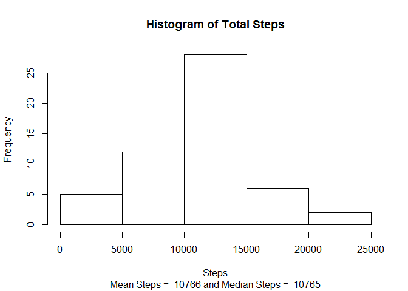
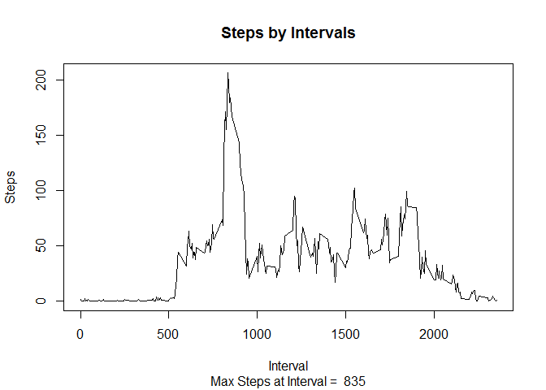
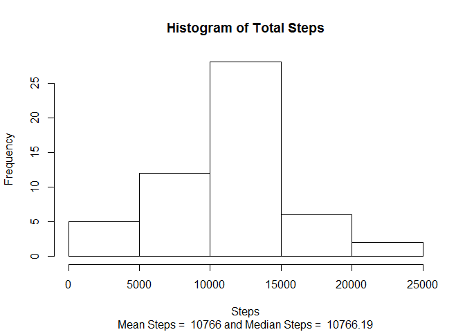
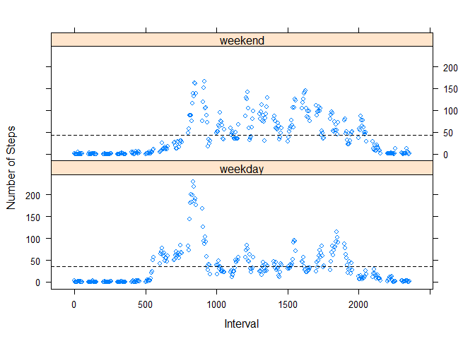

# Reproducible Research: Peer Assessment 1

# Reproducible Research: Peer Assessment 1
##Introduction

It is now possible to collect a large amount of data about personal movement using activity monitoring devices such as a Fitbit, Nike Fuelband, or Jawbone Up. These type of devices are part of the “quantified self” movement – a group of enthusiasts who take measurements about themselves regularly to improve their health, to find patterns in their behavior, or because they are tech geeks. But these data remain under-utilized both because the raw data are hard to obtain and there is a lack of statistical methods and software for processing and interpreting the data.

This assignment makes use of data from a personal activity monitoring device. This device collects data at 5 minute intervals through out the day. The data consists of two months of data from an anonymous individual collected during the months of October and November, 2012 and include the number of steps taken in 5 minute intervals each day.

## Loading and preprocessing the data
The data for this assignment can be downloaded from the course web site:

Dataset: Activity monitoring data [52K]
The variables included in this dataset are:

steps: Number of steps taking in a 5-minute interval (missing values are coded as NA)

date: The date on which the measurement was taken in YYYY-MM-DD format

interval: Identifier for the 5-minute interval in which measurement was taken

The dataset is stored in a comma-separated-value (CSV) file and there are a total of 17,568 observations in this dataset.


```r
## Read in activity monitor data 
## set strings as factors to false so dates are not interperted as factors
AMdata<-read.csv("activity.csv", stringsAsFactors=FALSE)

## convert date field to date datatype
AMdata$date<- as.Date(AMdata$date,"%Y-%m-%d")
## Look at structure of data
str(AMdata)
```

```
## 'data.frame':	17568 obs. of  3 variables:
##  $ steps   : int  NA NA NA NA NA NA NA NA NA NA ...
##  $ date    : Date, format: "2012-10-01" "2012-10-01" ...
##  $ interval: int  0 5 10 15 20 25 30 35 40 45 ...
```

```r
## Look at first few of data
head(AMdata)
```

```
##   steps       date interval
## 1    NA 2012-10-01        0
## 2    NA 2012-10-01        5
## 3    NA 2012-10-01       10
## 4    NA 2012-10-01       15
## 5    NA 2012-10-01       20
## 6    NA 2012-10-01       25
```


## What is mean total number of steps taken per day?

For this part of the assignment, you can ignore the missing values in the dataset.

Make a histogram of the total number of steps taken each day

Calculate and report the mean and median total number of steps taken per day


```r
## get sum of steps by date
stepDate<-aggregate(steps~ date, AMdata, sum)

##get mean and median
stepDateMean<-round(mean(stepDate$steps))
stepDateMedian<-median(stepDate$steps)

##plot steps
print(subtitle<-paste("Mean Steps = ", stepDateMean, "and Median Steps = ", stepDateMedian, sep= " "))
```

```
## [1] "Mean Steps =  10766 and Median Steps =  10765"
```

```r
hist(stepDate$steps, main = "Histogram of Total Steps", xlab="Steps", sub = subtitle)
```

 


## What is the average daily activity pattern?


Make a time series plot (i.e. type = "l") of the 5-minute interval (x-axis) and the average number of steps taken, averaged across all days (y-axis)

Which 5-minute interval, on average across all the days in the dataset, contains the maximum number of steps?


```r
## get aver of steps by date
stepInterval<-aggregate(steps~interval, AMdata, mean)


##get max
##what is max
stepIntervalMax<-max(stepInterval$steps)
## which row have max
maxRow<-which(stepInterval$steps == max(stepInterval$steps))
## which interval has max
maxInterval<-stepInterval[maxRow,1]


##plot steps
print(subtitle<-paste("Max Steps at Interval = ", maxInterval, sep= " "))
```

```
## [1] "Max Steps at Interval =  835"
```

```r
plot(stepInterval, type="l", main = "Steps by Intervals", xlab="Interval", ylab= "Steps", sub = subtitle)
```

 


## Imputing missing values
Note that there are a number of days/intervals where there are missing values (coded as NA). The presence of missing days may introduce bias into some calculations or summaries of the data.

Calculate and report the total number of missing values in the dataset (i.e. the total number of rows with NAs)


```r
notCC<-sum(!complete.cases(AMdata))
isCC<-sum(complete.cases(AMdata))
print(paste("The number of incomplete cases in the data set is", notCC, ",while the number of complete cases in the data set is", isCC ))
```

```
## [1] "The number of incomplete cases in the data set is 2304 ,while the number of complete cases in the data set is 15264"
```

Devise a strategy for filling in all of the missing values in the dataset. The strategy does not need to be sophisticated. For example, you could use the mean/median for that day, or the mean for that 5-minute interval, etc.

Create a new dataset that is equal to the original dataset but with the missing data filled in.

Make a histogram of the total number of steps taken each day and Calculate and report the mean and median total number of steps taken per day. Do these values differ from the estimates from the first part of the assignment? What is the impact of imputing missing data on the estimates of the total daily number of steps?


```r
## load sqldf library to help
library("sqldf", lib.loc="~/R/win-library/3.1")
```

```
## Loading required package: gsubfn
## Loading required package: proto
## Loading required package: RSQLite
## Loading required package: DBI
## Loading required package: RSQLite.extfuns
```

```r
## recode the dataset
##for NA steps use mean of interval from above
## merge datsets on interval
newAMdata<-merge(AMdata,stepInterval, by="interval")
## create clean data set 
cleanAMdata<-sqldf("select interval, date, case when steps_x is null then steps_y else steps_x end as steps from newAMdata")
```

```
## Loading required package: tcltk
```

```r
## get sum of steps by date
newstepDate<-aggregate(steps~ date, cleanAMdata, sum)

##get mean and median
newstepDateMean<-round(mean(newstepDate$steps))
newstepDateMedian<-round(median(newstepDate$steps),2)

##plot steps
print(newsubtitle<-paste("Mean Steps = ", newstepDateMean, "and Median Steps = ", newstepDateMedian, sep= " "))
```

```
## [1] "Mean Steps =  10766 and Median Steps =  10766.19"
```

```r
hist(stepDate$steps, main = "Histogram of Total Steps", xlab="Steps", sub = newsubtitle)
```

 

There is no difference in the mean values in the cleaned dataset from the original. They were both 10766 There is a slight difference in the median values of 1.19. The original median was 10765 and the cleaned median was 10766.19 

## Are there differences in activity patterns between weekdays and weekends?

For this part the weekdays() function may be of some help here. Use the dataset with the filled-in missing values for this part.

Create a new factor variable in the dataset with two levels – “weekday” and “weekend” indicating whether a given date is a weekday or weekend day.

Make a panel plot containing a time series plot (i.e. type = "l") of the 5-minute interval (x-axis) and the average number of steps taken, averaged across all weekday days or weekend days (y-axis). 


```r
library(lattice)

## add column weekday, weekend logic
cleanAMdata$weekday<-weekdays(cleanAMdata$date)
weekAMdata<-sqldf("select interval, date, steps, case when weekday = 'Saturday' or weekday = 'Sunday' then 'weekend' else 'weekday' end as weekend from cleanAMdata")
##make weekend a factor
weekAMdata$weekend<-as.factor(weekAMdata$weekend)

##aggregate
weekAMmean<-sqldf("select weekend, interval, sum(steps)/count(steps) as steps from  weekAMdata group by weekend, interval")

##plot
xyplot(steps~interval|weekend, weekAMmean,layout = c(1, 2),ylab="Number of Steps", xlab="Interval", panel = function(x, y, ...) {
        panel.xyplot(x, y, ...) 
        panel.abline(h = mean(y), lty = 2)
        })
```

 

The graph shows slight differences between weekend and weekday activity, with weekend showing a higher mean number of steps.
